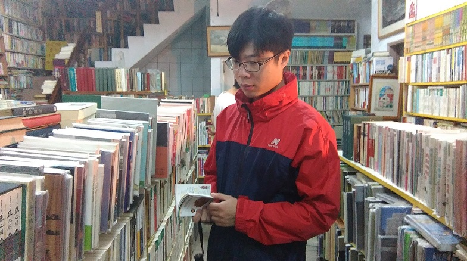

---

我是Kevin, 2012年3月毕业于杭州电子科技大学，硕士毕业课题和神经网络相关，基于各种算法构建电路模型。和现在的机器学习同一个概念。

2009.? 至 2009.? 中国航天科技有限公司    软件工程师（实习） 
2010.? 至 2010.? 杭州瑞弗科技有限公司    软件工程师（实习） 
2010.08至2011.1，摩托罗拉杭州杭州研发中心，4G软件工程师（实习） 
2012.03至今，    华为技术有限公司杭州研究所，底层软件开发工作、PL(项目管理)、SE（技术研究、方案设计）

联系方式：  
Email: <iverson_10@163.com>  

---

